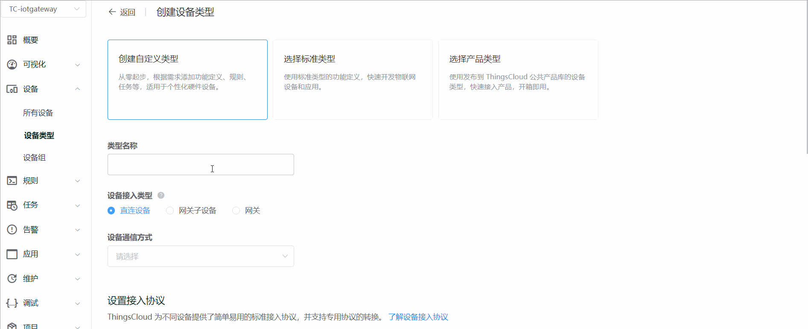
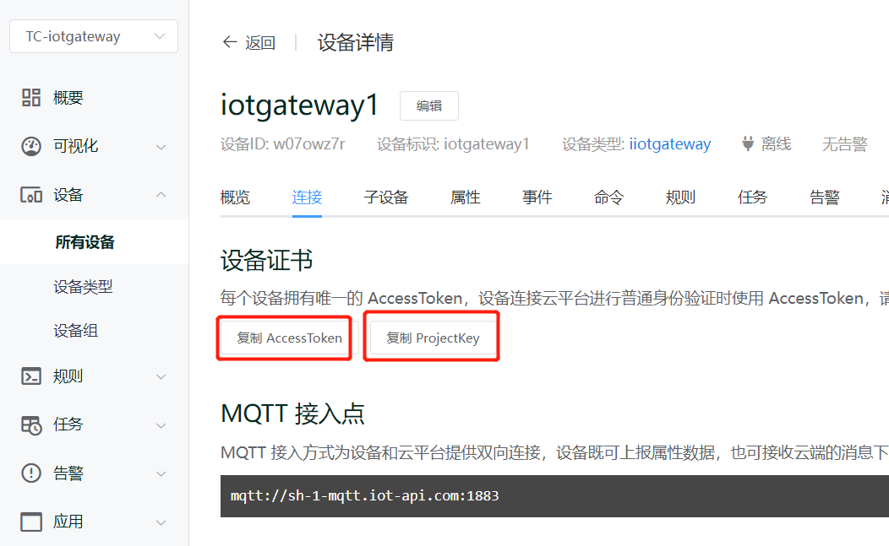
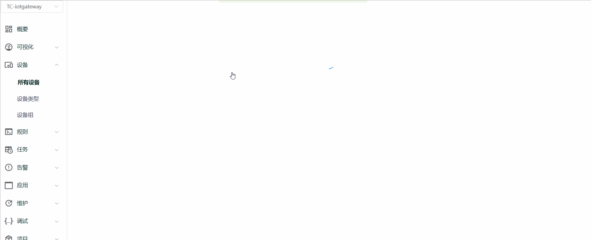

# 10分钟、零代码搭建物联网应用

 [ThingsCloud](https://www.thingscloud.xyz/)作为PaaS 平台，广泛部署在全球主流云计算基础设施平台上，也提供私有部署方式。在设备和用户之间建立**开箱即用**的云平台和云应用，实现数据采集、实时控制、数据可视化、开放 API，构建灵活强大的物联网应用。
 ## 成果展示
- 仪表板

- 手机app
  
## 手摸手
### 注册、登录、创建项目
   - 访问[控制台](https://console.thingscloud.xyz/signin)，注册并登录ThingsCloud。
   - 创建项目，并进入控制台
### 创建设备类型
   - 创建**网关**和**网关子设备**设备类型
  
### 创建设备
- 创建网关、网关子设备并进行绑定
  
- 复制**网关**的*Token*和*AccessKey*
- 
  
### 运行IoTGateway
   - 参考[Github](https://github.com/iioter/iotgateway/wiki)运行网关
   - 或者参考[Gitee](https://gitee.com/iioter/iotgateway/wikis/Home)
   - 访问网关[后台](http://localhost:518/),进入**传输配置**页面，修改配置，并保存
   - 
### 查看数据  
   - 
### 设备功能配置
  - 
### 大屏配置
  - 
### 设备面板
   设计面板，并保存
  - 

### App配置
  - 
### 创建App用户，关联设备
  - 

### 小程序或app访问
  - 进入app详情页，扫小程序二维码即可

## 建议
 - 总体体验非常丝滑
 - ios app不支持保存用户名密码，每次都要重新填写
 - 属性类型更改后无法上传，如某个属性从number类型修改为bool类型，数据不再更新
 - 历史数据图表偶尔不会自动更新数据