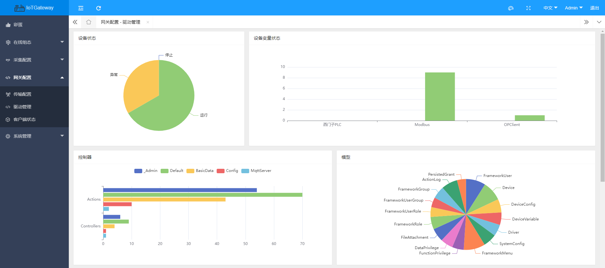
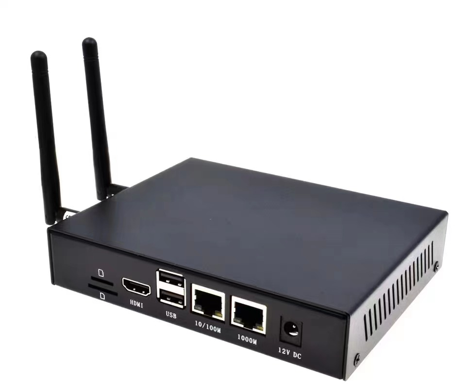
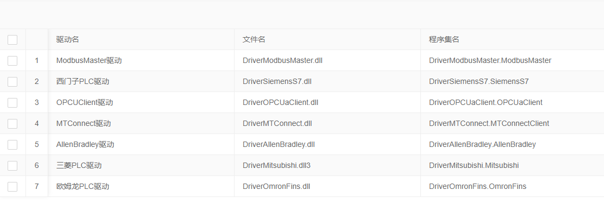
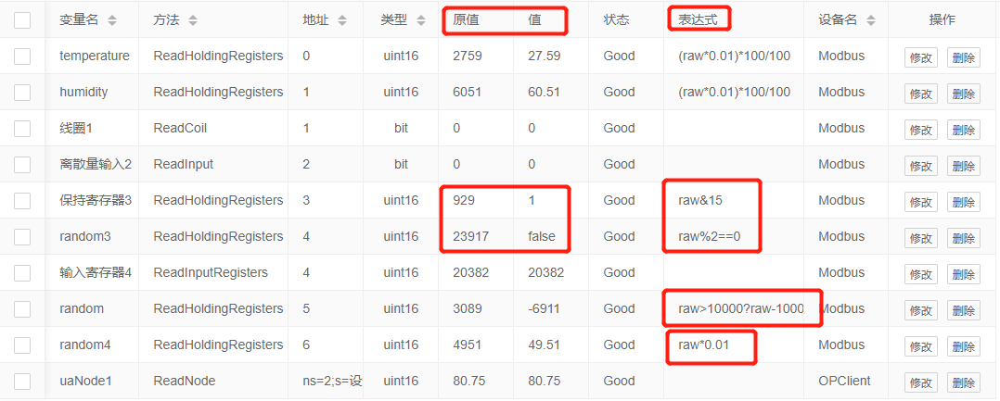

## 什么是工业物联网网关

工业物联网网关（IIoTGateway）是一种硬件设备或软件程序，作为**本地设备**(如PLC、扫码枪、机器人、数控机床、非标上位机等)与**云端系统**(如物联网平台、SCADA系统、MES系统等)之间的**桥梁**，在设备和云端之间流动的所有数据都通过IoT网关，如下图所示:

- 

### 数据的流向
  1. **设备**到**云端**的通信(**数据采集**)
  2. **云端**到**设备**的通信(**反向控制**)
  3. **设备**到**设备**的通信(**M2M**)

## 基于.NET6的开源工业物联网网关
1. 受益于.NET在工控以及医疗等领域的长期积累，网上的确分散着很多通信相关的dll、源码和项目，但至今没有基于B/S架构的开源项目，这也是本项目的初衷。
2. 依托.NET6开源、跨平台、高性能的特点，以及[WTM](https://github.com/dotnetcore/WTM) 框架的低代码开发方式，快速搭建起网关应用。目前已完成遥测和属性的上传，反向控制正在开发中。

- 
3. 项目地址
* github:[iotgateway](https://github.com/iioter/iotgateway/) 
* gitee:[iotgateway](https://gitee.com/iioter/iotgateway/)
* 项目文档:http://iotgateway.net/
* 在线体验:http://iotgateway.net:518/

## 开源网关具有以下特点
* ### 跨平台运行
 1. 既可以是windows，也可以是linux系统;
 2. 既可以是主机运行，也可以通过docker运行;
 3. 既可以是x86主机，也可以是arm32、arm64嵌入式开发板。
- 
- 

* ### 内置多种驱动
驱动可以看做公司的一种无形资产。目前提供Modbus完整协议、西门子全系列PLC、三菱QPLC、欧姆龙PLC、ABPLC、MTConnect数控机床等驱动。当然你也可以通过驱动Demo实现自己的驱动，也可以集成业内流行的[IoTClient(码农一生)](https://gitee.com/zhaopeiym/IoTClient)、HSL(胡工)等提供的驱动进行整合。
- 

* ### 计算表达式
类似于js等脚本语言，C#也可以作为脚本进行动态编译执行，你可以随时修改表达式对数据进行二次计算，不只是倍率的计算哦。
- 

* ### MQTT服务
内置MQTT Server，可以通过订阅数据与你的业务系统进行集成，当然网关也可以作为MQTT客户端，将数据推送到你的MQTT服务中去。
- 
- 

* ### OPCUA服务
内置OPCUA Server，你的工控系统可以很方便的获取数据。注意，项目中OPCUA相关功能仅用作学习及测试，**若使用OPCUA协议请联系OPC基金会进行授权，产生一切纠纷与本项目无关**。
- 

* ### 数字孪生3D可视化
通过使用threejs搭建了数字孪生的demo，前端通过基于WebSocket的Mqtt协议订阅数据变化，实时获取数据更新，而不是通过WebAPI轮训。
- 
- 

* ### 在线组态
无缝集成在线组态项目，快速设计和部署你的可视化应用。
- 
- 

## 为什么需要物联网网关
* ### 协议转换
面对不同年代、不同厂家、不同协议的设备多少会让人头疼，IoT网关会帮助你**屏蔽协议的差异**，转换为常用的物联网协议(如MQTT、HTTP等)输出到平台端，让你有更多时间专注于平台端的业务建设。

* ### 保证安全
所有物联网设备都有被外部影响和攻击的可能，但IoT网关在互联网和设备本身之间增加了另外一层，大幅度减少了连接到互联网的设备的数量，网关变成了第一道防线，进而防止外部各方对物联网设备进行未经授权的控制。

* ### 容易扩展

在工业现场的高度分散性的前提下，随着连接的设备数量不断增加，不同协议设备的持续接入，只能通过网关来管理和控制这些复杂的变化，而不是以往牵一发而动全身的痛苦的升级。

* ### 数据处理
1. ####  数据预处理

  如**倍率**、**偏移量**处理等，这有助于边缘计算的发展，因为他本身就是边缘智能的一种简单应用。

2. #### 数据过滤

  设备产生的海量数据中，全部发送到平台端肯定是不堪重负的，一方面传输、处理和存储都是有成本的;另一方面可能只有一部分是需要关注的，如**变化的**产量，就需要变化才上传，一直推送不变的值是没有意义的。

3. #### 数据汇总和聚合

  有些场景下不同设备或相同设备的不同变量是需要聚合计算后发送到平台端的，有些原始数据没有特别大的价值，当然这也可以**分担一部分平台端的压力**。

4. #### 数据缓存

  网络通信不是100%可靠的，断线时IoT网关既需要**暂存数据**，当网络恢复后发送至云端;又需要**存储云端的控制策略**，让控制流程及时执行。