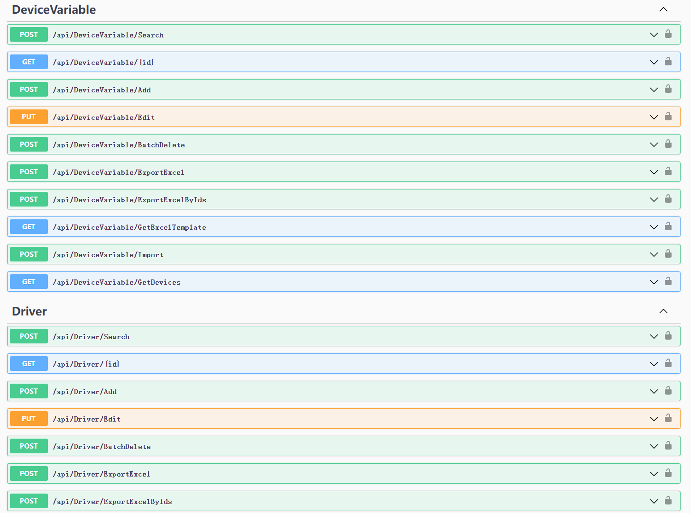
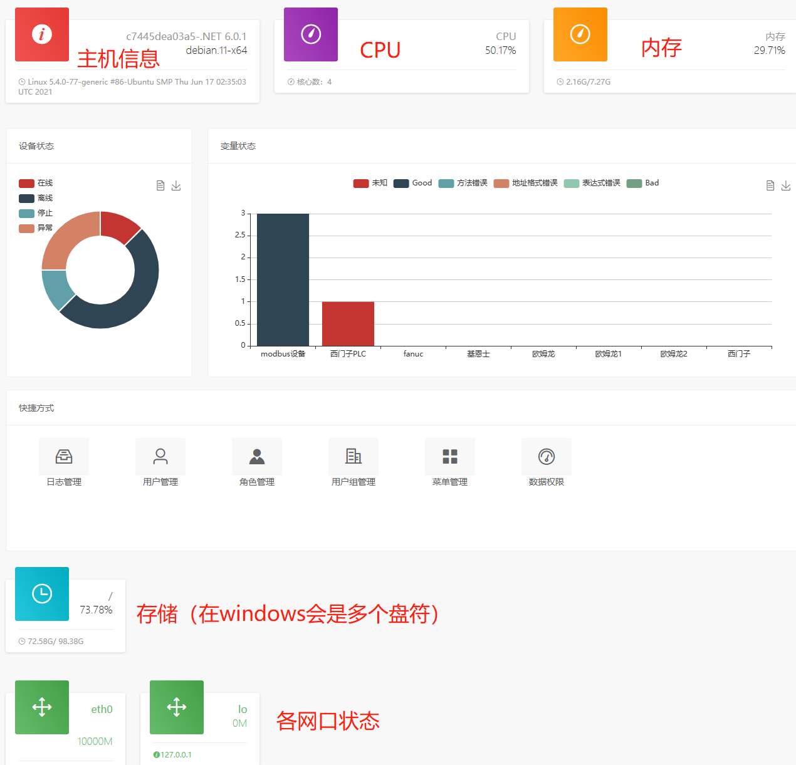
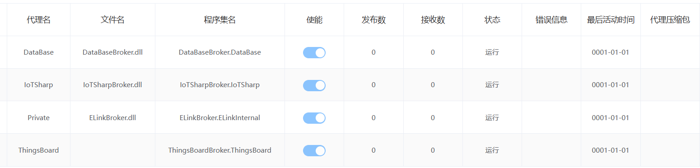
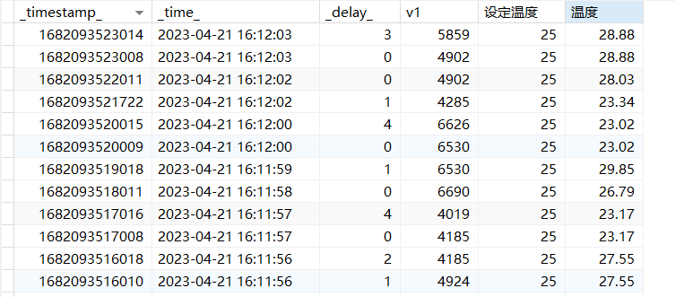

## 企业网关在线体验
[http://iotgateway.net:5518](http://iotgateway.net:5518)
> 用户名：admin
>
> 密码：iotgateway.net

eLink（easyLink、edgeLink）网关，对标行业顶级网关，源码交付。有以下特性：

## vue前后端分离
设备树单页面几乎可以完成所有功能

## 标准的webapi
方便二次开发

## 主机指标监控
主机信息、CPU、内存、磁盘、网络在内的几乎所有指标

## 几乎支持所有plc和cnc
支持几乎所有plc、cnc、电力、环保、楼宇等协议

## 北向多路输出
北向代理插件化，灵活扩展

## 北向断网、断电数据缓存
## 边端高可用
精简的k8s，保证边端业务持续可靠
## 关系库宽表存储、自动迁移表结构
- 支持了传统开发者最喜欢的关系库存储
- 宽表存储，即每行多个变量
- 支持按照年、月、日分表
- 支持结构自动迁移（当设备的变量变化自动迁移）

## 读取公式、写入公式分离