- 动态智能可视化工具，通过拖拽、绑定数据的方式完成设备组态、大屏等功能。
- 帮助企业实现集动态交互、丰富展示、数据管理等一体的全功能可视化产品，为物联网、工业互联网、电力能源、水利工程、智慧农业、智慧医疗、智慧城市等智能可视化场景提供智能可视化解决方案。

## 多协议
支持websocket、mqtt、webapi等协议，方便二次开发和接入
几千余款图元，支持png、gif、svg等自定义图元导入

## 组态后台
> 通过拖拽和数据绑定的方式完成组态

## 丰富的图元
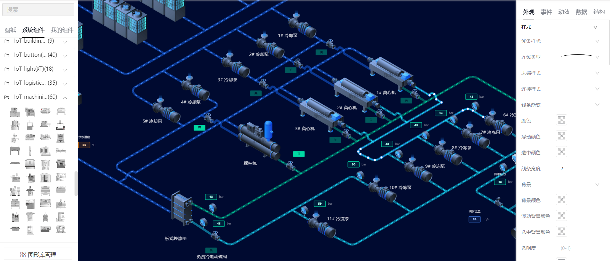

## 网关无缝对接
组态项目支持多个网关对接，直接绑定网关点位数据

## 智慧城市

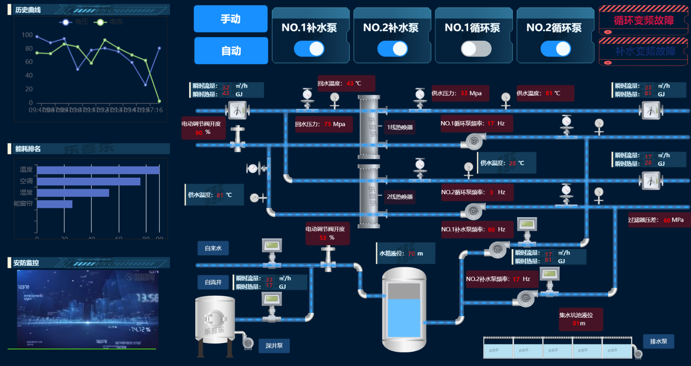
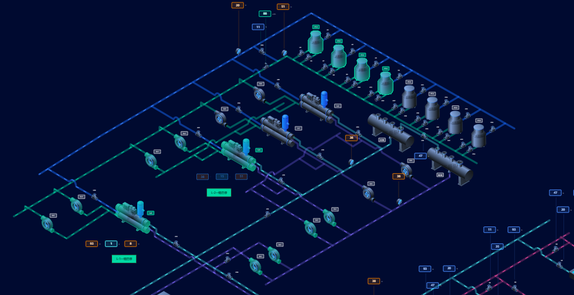
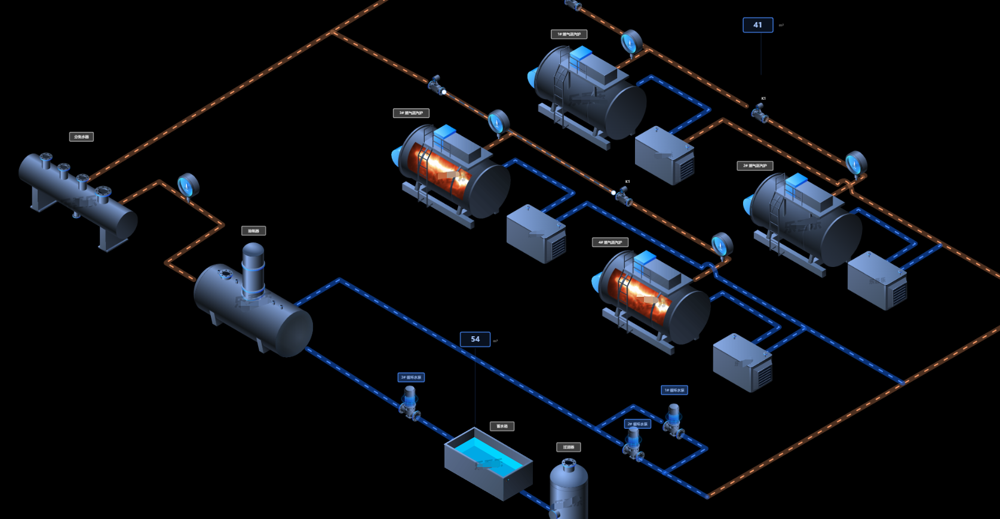
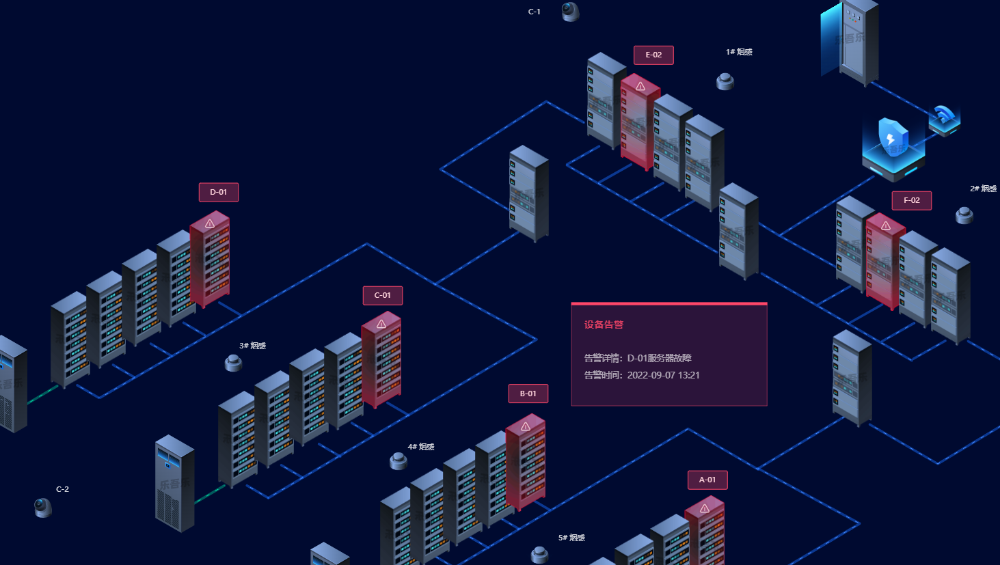

## 电力行业

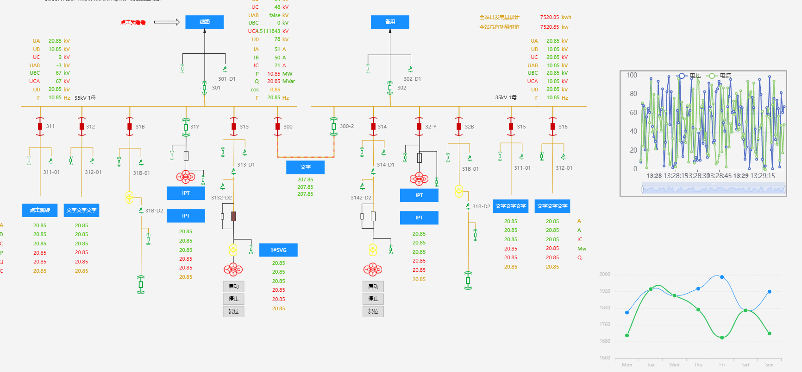
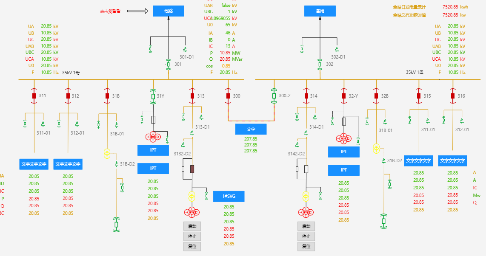
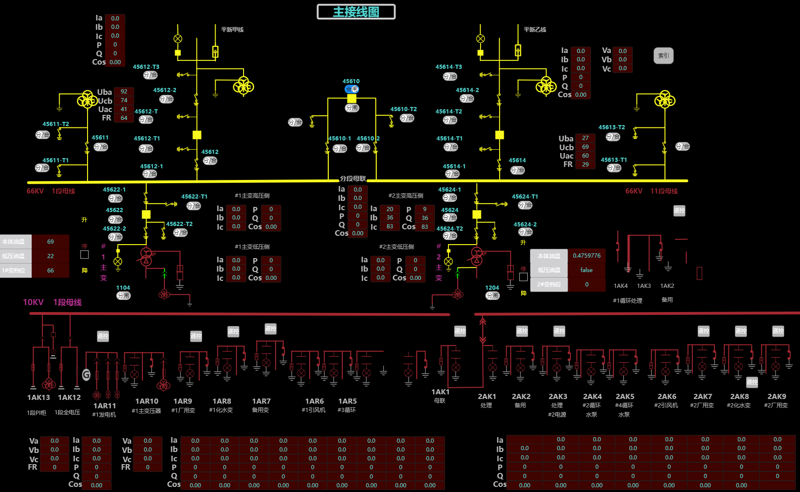
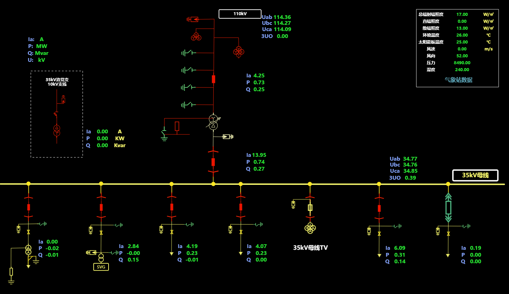

## 水处理

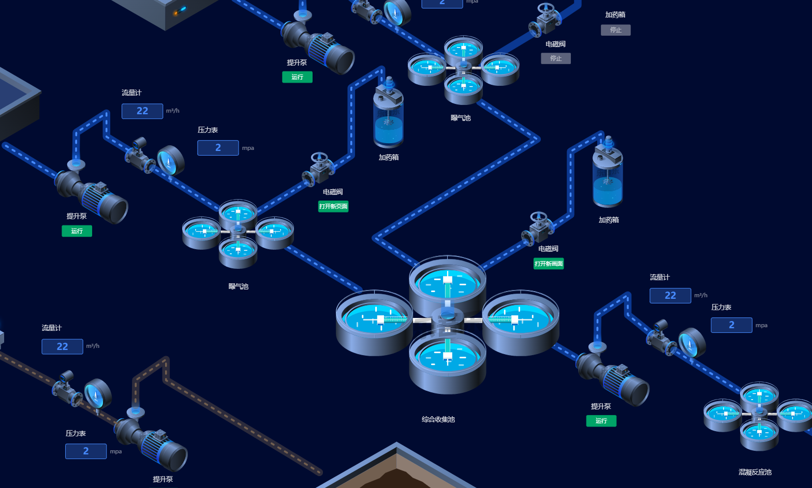
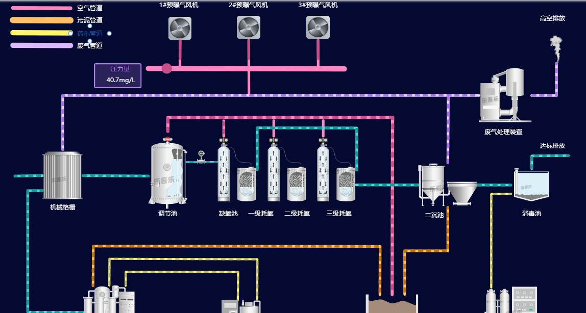
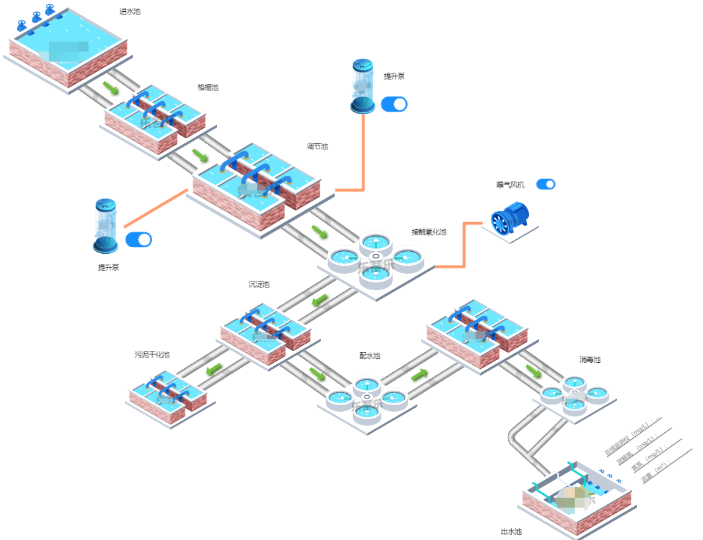