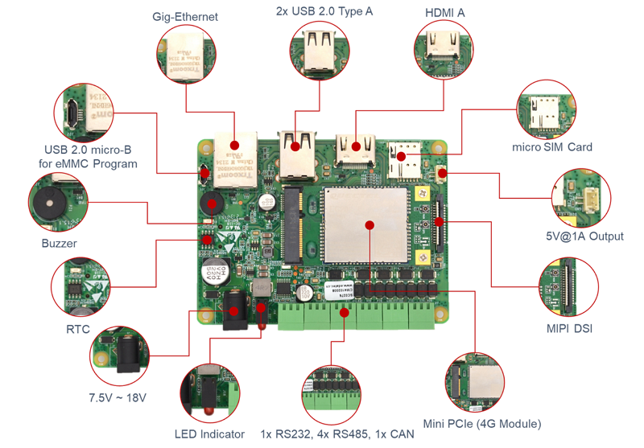
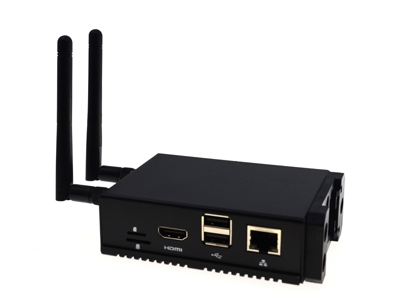
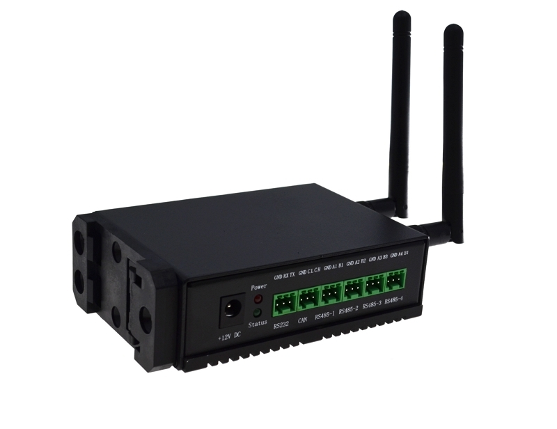

[淘宝购买：https://iotgateway.taobao.com/](https://item.taobao.com/item.htm?spm=a1z10.1-c.w4004-13769403149.4.67fb40c29fW8sO&id=679535257919)

IIoT-A080是一款面向物联网及工业现场数据采集应用设计的嵌入式计算机, 解决了CPU、无线模组和PMU的散热问题, 通过外置WIFI/BT、4G天线提高无线通讯的可靠性.

- 系统可以根据不同的应用配置成1GB|2GB|4GB|8GB的RAM(内存)和8GB|16GB|32GB的eMMC(存储), 2.4/5.8G双频 WiFi和蓝牙(可选),支持外置天线.
- 对于需要大数据容量存储应用场景,系统提供一路SD卡通道用于存储用户数据,用户可以根据应用需求选择不同容量的SD卡存储数据, 相比内置eMMC存储器, SD卡具有更大的容量和更低的成本;
- IIoT-A080提供4路RS485, 1路CAN和1路RS232接口, 支持4G/LTE模组, 电池备份的实时时钟和告警蜂鸣器.
- IIoT-A080的DSI接口支持7''显示屏. HDMI接口采用标准HDMI座子.
- IIoT-A080提供2路USB2.0和1路Micro USB2.0接口, Micro USB2.0用于更新系统镜像.
- 系统支持+12V~18VDC电源输入, 提供5V@1A的输出接口.
- IIoT-A080连接器从前后2端出线, 底部由一块103 x 73 x 5mm的散热片为CPU, 无线模组和PMU提供优异的散热性能, 使整机能在高温的环境下可靠地工作.
- 经实际测试IIoT-A080可以在环境温度 -25~60°C 下 全速可靠地正常工作.
- IIoT-A080铝合金散热片底部预留4个M2.5的螺丝孔, 便于用户把IIoT-A080安装在其他设备上. IIoT-A080 支持DIN导轨安装．

## 硬件参数

### CPU
- Cortex-A72, 1.5GHz ARM v8 64-bit CPU
- 支持H.264, H.265解码, 支持4Kp60视频播放
- 支持H.264编码
- 支持OpenGL EL 3.0
### DDR内存
- LPDDR4, 高达3200MT/s
- 1GB | 2GB | 4GB | 8GB
### 存储
- 8GB | 16GB | 32GB eMMC用于主文件系统
- 1x microSD Slot (用于扩展用户数据存储)
### 显示
- 1x HDMI接口
- 1x DSI 显示屏接口
- 1x HDMI FPC软排线接口
### 有线接口
- 1x 10/100/1000M以太网
- 2x USB2.0(外置)
- 1x Micro USB2.0(编程)
### 无线通讯
- 1x 4G/LTE module(可选), 全网通, 支持移动, 联通, 电信网络制式
- 1x 2.4G/5.8G WiFi, 兼容IEEE 802.11 b/g/n/ac 标准
- 1x Bluetooth 5.0, 支持BLE
- WiFi/BLE外置天线, 已通过无线认证
### 工业控制接口与功能
- 4x RS485
- 1x CAN
- 1x RS232
- 1x 带备份电池的RTC
- 1x LED电源指示
- 1x LED系统工作状态指示
- 1x 蜂鸣器
### 可扩展接口
- Mini PCIe座子支持标准的1 x PCIe Gen2 1x 设备扩展
### 电源供电
- 9~36V DC 电压范围输入，凤凰端子输入接口(可选)
### 工作温度范围
- -25 ~ 60°C 环境温度
# 尺寸
- 10.3cm(长) x 7.3cm(宽) x 3.2cm(高)
## 软件参数
### 成熟 稳定
- 兼容原生支持Ubuntu Server 32-bit和64-bit系统
- BSP支持APT在线安装和升级
- 支持Kernel和系统任意升级
- eMMC内置最新64-bit OS, 开箱即用
## 接口框图
### 正面

## 产品照片
### 整机
   
   
   

## 订购编码

## 功能参数
|功能	|参数|
|--|---|
|CPU|	 4核, ARM Cortex-A72(ARM v8), 1.5GHz, 64位 CPU|
|内存	|1GB / 2GB / 4GB / 8GB 可选|
|eMMC闪存	|8GB / 16GB / 32GB 可选|
|SD卡	|eMMC用于主文件系统, 另外可支持TF卡扩展用于数据存储|
|以太网	|1x 千兆以太网|
|WiFi / 蓝牙|	2.4G / 5.8G双频WiFi, 蓝牙5.0|
|4G通信|	支持移远EC20 4G LTE模块|
|HDMI	|1x 标准HDMI|
|HDMI| FPC触控屏	1x FPC HDMI, 支持USB触控, PWM调光|
|DSI	|1x DSI, 支持 7寸官方触摸屏|
|USB Host|	2x USB 2.0 Type A, 1x USB 2.0集成于Mini PCIe接口, 1x USB micro-B用于eMMC烧录|
|RS485	|4x RS485|
|RS232	|1x RS232, 可用于系统默认控制台, 支持配置为标准串口|
|CAN总线|	1x CAN|
|Mini PCIe|	1-lane PCIe 2.0, 最高支持5Gbps, 1x USB 2.0 Host|
|实时时钟|	1x RTC|
|蜂鸣器	|1x 蜂鸣器|
|直流电源输出|	5V@1A, 可用于支持 7寸官方触摸屏供电|
|LED指示灯|	红色(电源指示), 绿色(系统状态指示)|
|电源输入	|7.5V ~ 18V|
|尺寸	|10.3cm(长) x 7.3cm(宽) x 3.2cm(高)|
|外壳	|全金属外壳, 支持DIN导轨安装|
|散热片	|一整面CNC铝合金散热片|
|天线配件	|支持可选WiFi / BT外置天线, 已通过无线认证, 可选4G外置天线|
|工作环境温度|	全速运行于-25 ~ 60°C环境温度|
|操作系统	|兼容Ubuntu Server官方OS, 提供BSP软件支持包, 并支持APT在线安装和更新|
