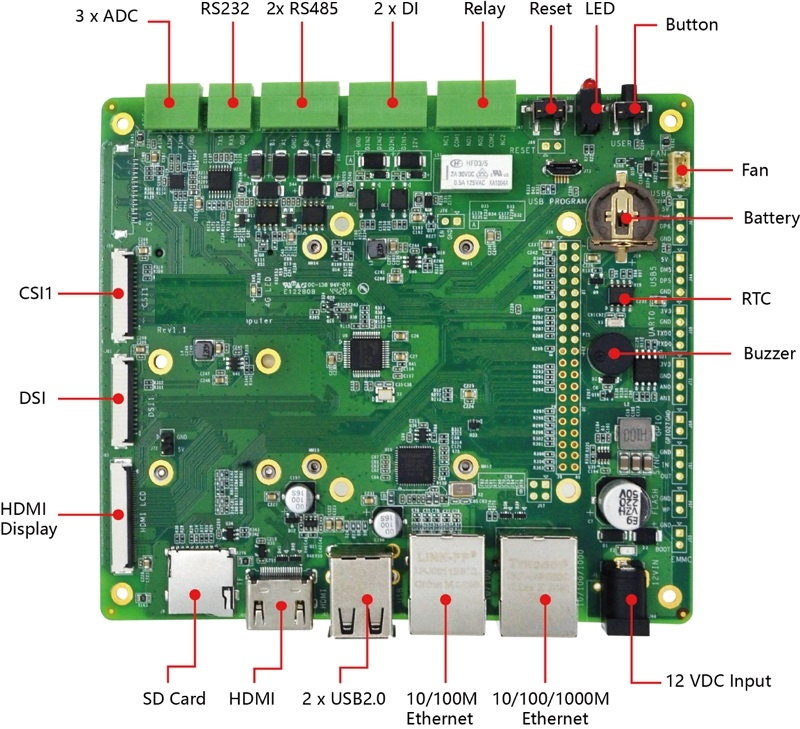
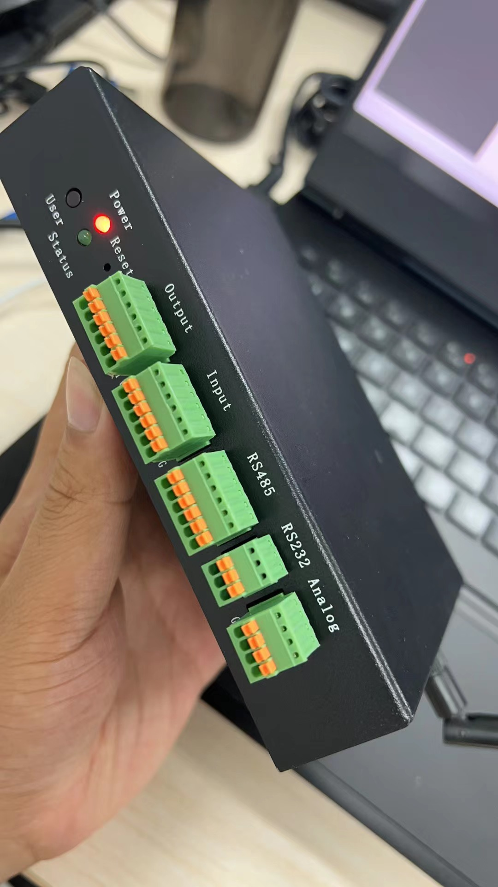
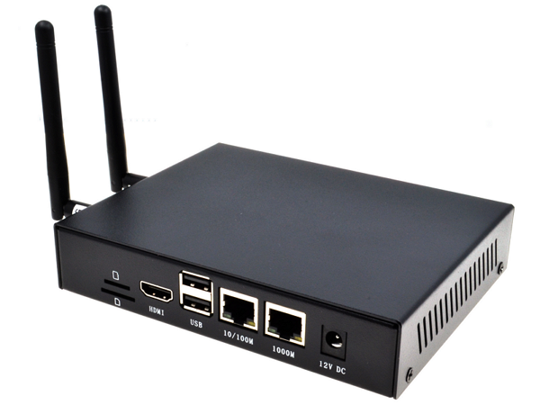

[淘宝购买：https://iotgateway.taobao.com/](https://item.taobao.com/item.htm?spm=a1z10.1-c.w4004-13769403149.2.487440c2LpWLE0&id=679174732349)

IIoT-B100可以根据不同的应用配置成1GB/2GB/4GB/8GB 的 RAM 和8GB/16GB/32GB 的 eMMC。

它提供多种工业通讯接口和功能如多路 RS232，RS485，多路高精度ADC，隔离IO输入，继电器控制，电池备份的实时时钟，告警蜂鸣器。它也提供了强大的通讯能力，1路带PoE功能的千兆以太网接口，1路10/100M网口，4G/LTE模块，经过认证的 2.4/5.8G 双频 WiFi 和蓝牙，支持外置天线。

IIoT-B100 可以支持一路官方8百万像素的摄像头，一路DSI显示接口和一路HDMI的排线接口。其他特征包括板载32Mb串行Flash用于储存系统数据，12~18V宽范围供电，重要的接口都做了 ESD 保护。

系统提供非常强的扩展能力，Mini-PCIe的座子提供PCIe 1xGen2 接口扩展，除支持标准的40针扩展接口外，还提供2路4针USB接口用于机壳内部扩展，1路TTL电平的RS232接口等，以充分利用其强大的通信功能来满足工业场景中的各种要求

## 性能测试TODO

**B100**型号，搭载**iotgatewayv0.80**版本进行测试

> 下面测试结论是在**启动网关内部Mqtt服务**、**启动OPCUaServer**的情况下进行，
> 
> 若**使用其他平台端MqttServer**并**禁用OPCUaServer**结果会有大幅提升，后续会做详尽测试。

|设备数	 |变量总数	|总CPU	|网关程序占用内存	|单设备极限周期	|测试时间|
|-----	|--------   |---	   |-----	       |-----	         |-------|
|1       |1	         |62%	   |268M	          |2.07ms	   |2022年7月24日12:13:59|
|1	      |50	      |65%	   |328M    	    |295ms	   |2022年7月24日12:19:22|
|10	   |500	      |83%	   |289M	          |846ms	   |2022年7月24日13:06:14|
|29	   |1450	      |87%	   |283M	          |1061ms	   |2022年7月24日14:30:06|

## 硬件参数

### CPU
- Cortex-A72, 1.5GHz ARM v8 64-bit CPU
- 支持H.264, H.265解码, 支持4Kp60视频播放
- 支持H.264编码
- 支持OpenGL EL 3.0
### DDR内存
- LPDDR4, 高达3200MT/s
- 1GB | 2GB | 4GB | 8GB
### 存储
- 8GB | 16GB | 32GB eMMC用于主文件系统
- 1x microSD Slot (用于扩展用户数据存储)
### 显示
- 1x HDMI接口
- 1x DSI 显示屏接口
- 1x HDMI FPC软排线接口
### 有线接口
- 1x 10/100/1000M以太网
- 1x 10/100M以太网
- 2x USB2.0(外置)
- 1x Micro USB2.0(编程)
### 无线通讯
- 1x 4G/LTE module(可选), 全网通, 支持移动, 联通, 电信网络制式
- 1x 2.4G/5.8G WiFi, 兼容IEEE 802.11 b/g/n/ac 标准
- 1x Bluetooth 5.0, 支持BLE
- WiFi/BLE外置天线, 已通过无线认证
### 工业控制接口与功能
- 2x RS485
- 1x RS232
- 1x Serial TTL
- 3x 12 bits ADC
- 1x 带备份电池的RTC
- 1x LED电源指示
- 1x LED系统工作状态指示
- 1x 蜂鸣器
- 2x 隔离IO
- 1x 非隔离IO
- 1x 单刀双置继电器
- 1x 可调速风扇控制
### 可扩展接口
- Mini PCIe座子支持标准的1 x PCIe Gen2 1x 设备扩展
### 电源供电
- 12~18V DC 电压范围输入，凤凰端子输入接口(可选)
- 预计22年9月后推出退出24V DC版本
### 工作温度范围
- -25 ~ 60°C 环境温度
# 尺寸
- 13cm(长) x 11.5cm(宽) x 2cm(高)
## 软件参数
### 成熟 稳定
- 兼容原生支持Ubuntu Server 32-bit和64-bit系统
- BSP支持APT在线安装和升级
- 支持Kernel和系统任意升级
- eMMC内置最新64-bit OS, 开箱即用
  
## 接口框图
### 正面

## 产品照片
### 整机
   
   
   

## 订购编码

## 功能参数
|功能	|参数|
|--|---|
|CPU|	 4核, ARM Cortex-A72(ARM v8), 1.5GHz, 64位 CPU|
|内存	|1GB / 2GB / 4GB / 8GB 可选|
|eMMC闪存	|8GB / 16GB / 32GB 可选|
|SD卡	|eMMC用于主文件系统, 另外可支持TF卡扩展用于数据存储|
|以太网	|1x 千兆以太网|
|WiFi / 蓝牙|	2.4G / 5.8G双频WiFi, 蓝牙5.0|
|4G通信|	支持移远EC20 4G LTE模块|
|HDMI	|1x 标准HDMI|
|HDMI| FPC触控屏	1x FPC HDMI, 支持USB触控, PWM调光|
|DSI	|1x DSI, 支持 7寸官方触摸屏|
|USB Host|	2x USB 2.0 Type A, 1x USB 2.0集成于Mini PCIe接口, 1x USB micro-B用于eMMC烧录|
|RS485	|2x RS485|
|RS232	|1x RS232, 可用于系统默认控制台, 支持配置为标准串口|
|Serial(TTL)	|1x Serial(TTL), 可用于系统默认控制台, 支持配置为标准串口|
|ADC通道	|3x ADC IN Channel, 12位ADC|
|隔离IO	|2x DI|
|非隔离IO	|1x DIO|
|继电器	|1x 单刀双置继电器|
|Mini PCIe|	1-lane PCIe 2.0, 最高支持5Gbps, 1x USB 2.0 Host|
|实时时钟|	1x RTC|
|用户按键|	1x 用户按键|
|蜂鸣器|	1x 蜂鸣器|
|风扇	|1x 可调速风扇控制接口|
|直流电源输出|	5V@1A, 可用于支持 7寸官方触摸屏供电|
|LED指示灯|	红色(电源指示), 绿色(系统状态指示)|
|电源输入	|7.5V ~ 18V|
|尺寸	|13cm(长) x 11.5cm(宽) x 2cm(高)|
|外壳	|全金属外壳, 支持DIN导轨安装|
|散热片	|一整面CNC铝合金散热片|
|天线配件	|支持可选WiFi / BT外置天线, 已通过无线认证, 可选4G外置天线|
|工作环境温度|	全速运行于-25 ~ 60°C环境温度|
|操作系统	|兼容Ubuntu Server官方OS, 提供BSP软件支持包, 并支持APT在线安装和更新|
