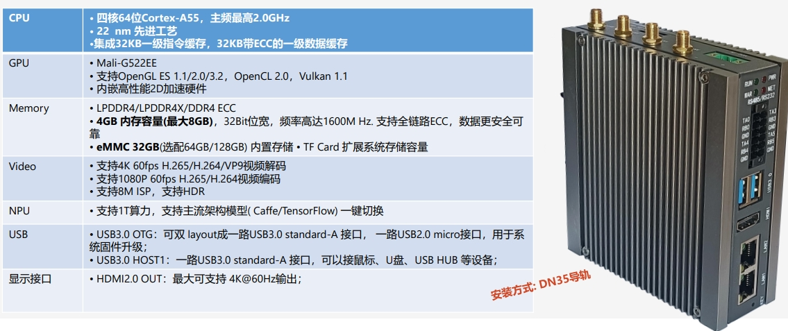

[淘宝购买：即将上架](https://iotgateway.taobao.com/)

IIoT-B200可以根据不同的应用配置成4GB/8GB 的 RAM 32GB 的 eMMC。

它提供多种工业通讯接口和功能如多路RS232、RS485，继电器控制，3路光耦输入，电池备份的实时时钟，可编程LED。它也提供了强大的通讯能力，2路千兆以太网接口，4G/LTE模块，经过认证的 2.4/5.8G 双频 WiFi 和蓝牙，支持外置天线。

四核64位处理器 Cortex-A55架构 主频高达2.0GHz

系统提供非常强的扩展能力，Mini-PCIe的座子提供PCIe 1xGen2 接口可扩展SSD，以充分利用其强大的通信功能来满足工业场景中的各种要求

## 硬件参数

  
## 接口框图
### 正面

## 产品照片
### 整机

## 订购编码

## 功能参数