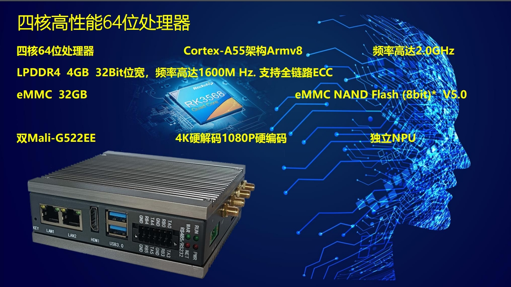
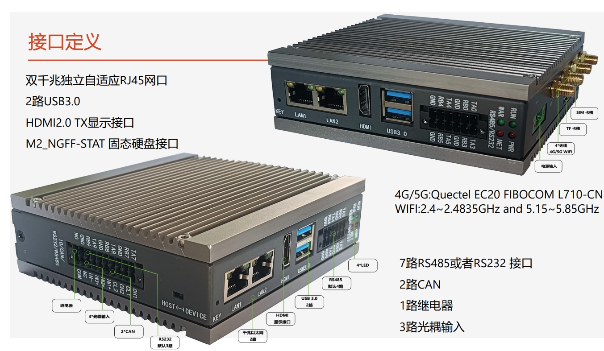
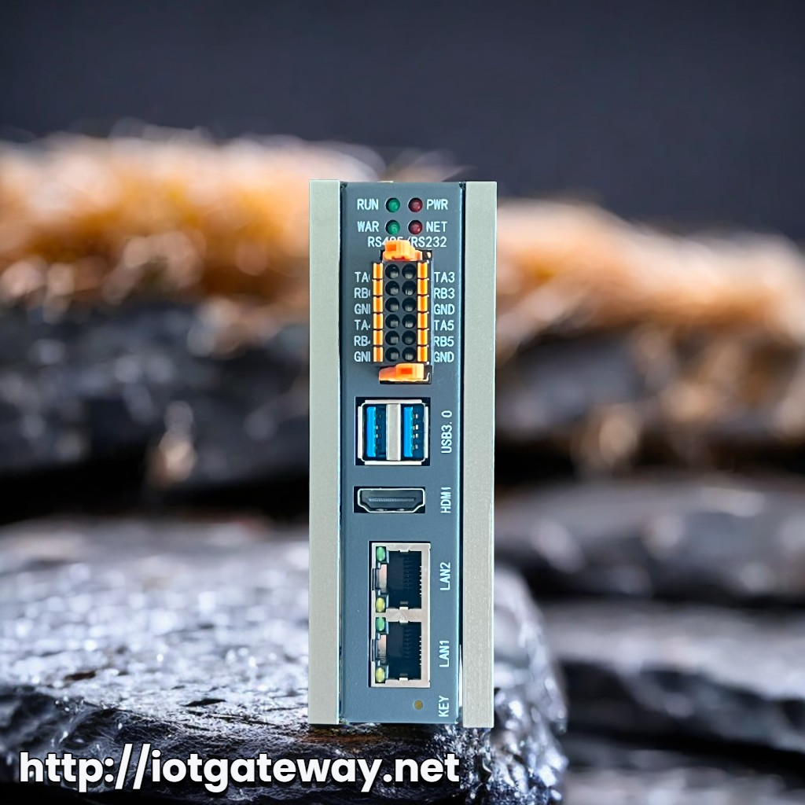
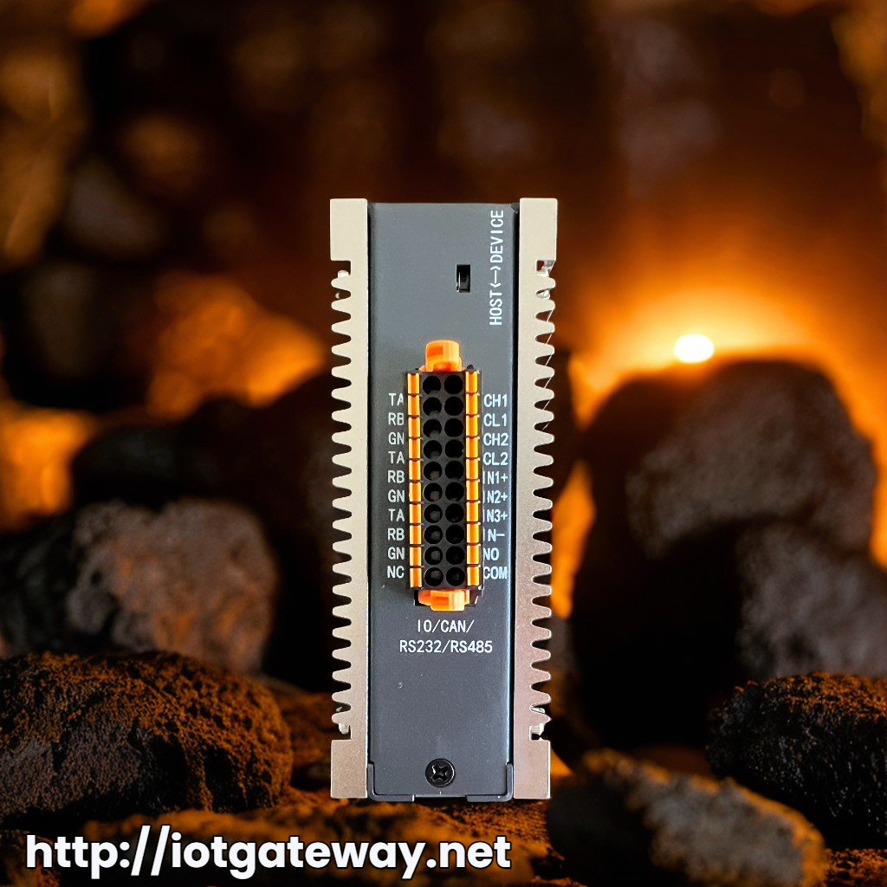
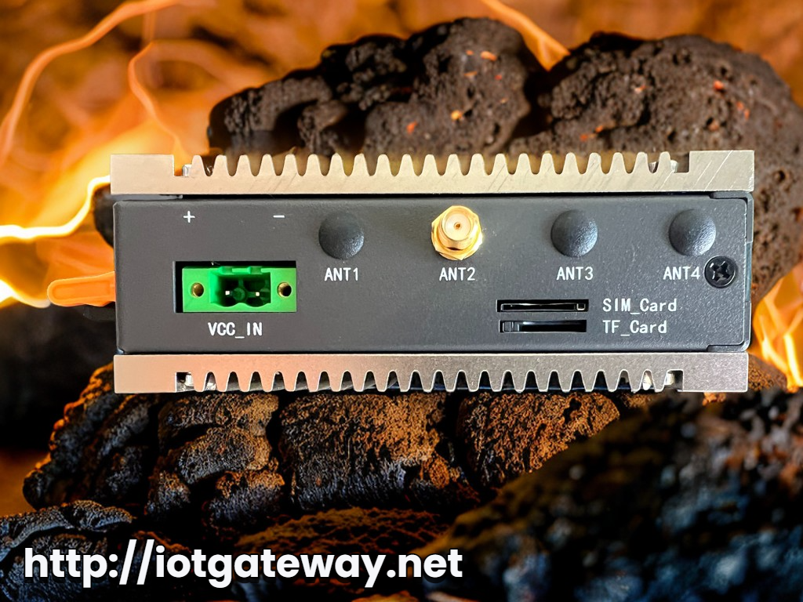
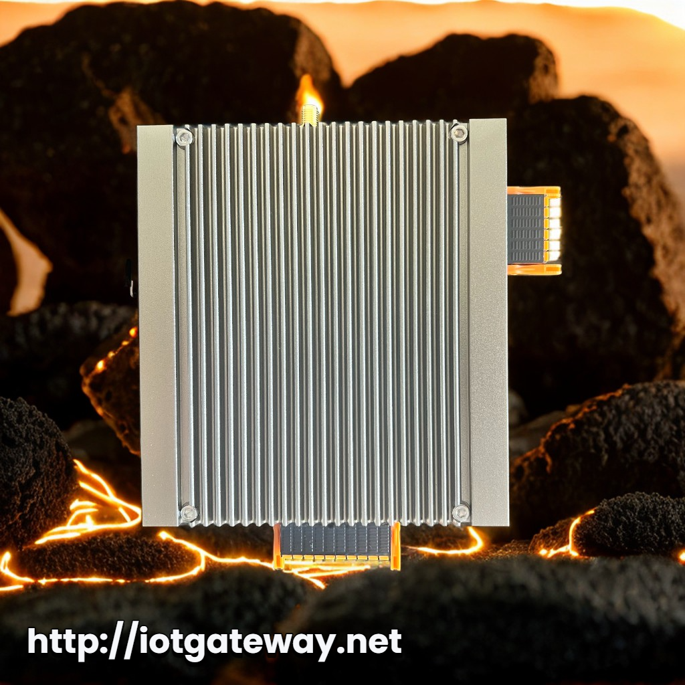

[淘宝购买连接：https://item.taobao.com/item.htm?id=679174732349](https://item.taobao.com/item.htm?id=679174732349)

IIoT-B200可以根据不同的应用配置成4GB/8GB 的 RAM 32GB 的 eMMC。
- **四核64位处理器** Cortex-A55架构 **主频高达2.0GHz**
- **2路千兆以太网**接口
- **7路**RS232、RS485
- **1路继电器**控制（30VDC 3A;250VAC 3A）
- **3路光耦输入**
- 电池备份的实时时钟**RTC**
- **可编程LED**
- **4G**/LTE模块，经过认证的 2.4/5.8G 双频 **WiFi** 和蓝牙，支持外置天线
系统提供非常强的扩展能力，Mini-PCIe的座子提供PCIe 1xGen2 接口可扩展SSD，以充分利用其强大的通信功能来满足工业场景中的各种要求

## 硬件参数

  
## 接口框图

## 产品照片

## 功能参数