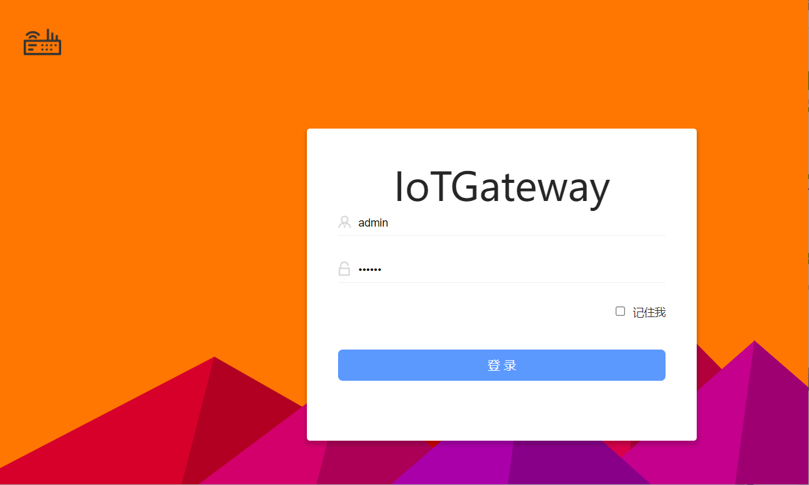

## 准备

:::danger 注意
使用Visual Studio 2022版本，因为要使用.NET8
:::
## 获取源码
根据你的网络环境，访问[github](https://github.com/iioter/iotgateway) 或[gitee](https://gitee.com/iioter/iotgateway) ,

git克隆
```
git clone https://gitee.com/iioter/iotgateway.git
```
或下载ZIP获取源代码

打开解决方案**IoTGateway.sln** 

## 生成解决方案

:::danger 注意
一定要生成解决方案，因为通信驱动是通过反射加载的，如果不生成则无法加载 `driver`
:::

## 运行IoTGateway项目

`IoTGateway`项目设为启动项目，运行


## 访问网关后台

Chrome浏览器访问 `http://localhost:518/Login/Login`

用户名: `admin`  密码: `iotgateway.net`


