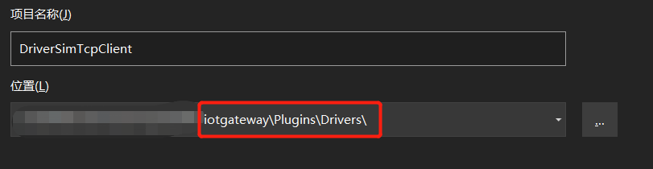
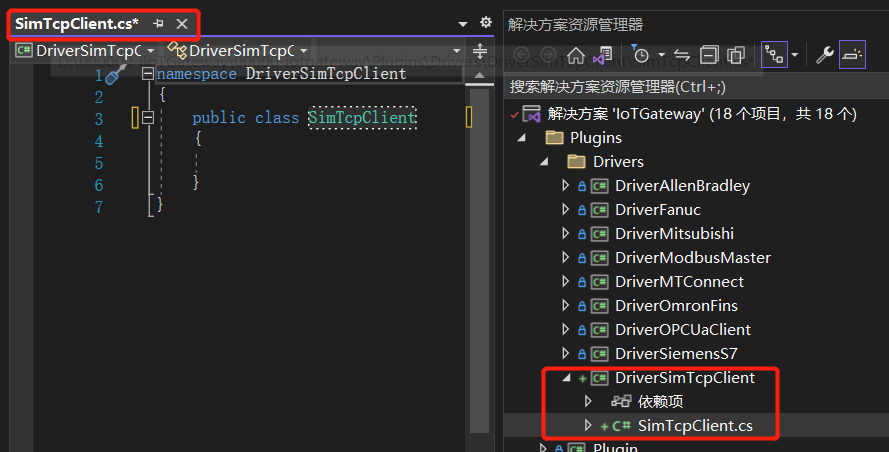

## 场景模拟
 假设你有一批非标设备需要对接，对方提供了如下协议文档：
### 协议概述
> 设备作为**TCPServer**，端口**6666**
> 字节序:**Little-Endian**，即低地址存放低位
### 请求回复
> 需要你主动发起读取**请求**:**0x01 02 03 04**
> 设备**回复**:**0x08 01 41 D6 3D 71 1A 20**
### 参数说明
1. **总字节数**
   > (*byte[0]*)即0x08:用于简单的校验
2. **运行状态**
   > (*byte[1]*)即0x01:1为运行;其他为停止
3. **设备温度**
   > (*byte[2]-byte[5]*)即0x41 D6 3D 71：单精度浮点数值26.78
4. **电机转速**
   > (*byte[6]-byte[7]*)即0x1A 20：对应16进制无符号整型，倍率0.01值66.88

## 驱动开发
我们根据上面的协议，开发驱动。请先浏览上一篇**驱动简介**
### 创建驱动项目
1. 在解决方案->Drivers文件夹，右键添加->新建项目->C#类库
   
2. 项目名**DriverSimTcpClient**，放在```iotgateway\Plugins\Drivers```路径下
   
3. 修改*Class1*为*SimTcpClient*
4. 双击项目，修改配置
   
  ```xml title="iotgateway\Plugins\Drivers\DriverSimTcpClient\DriverSimTcpClient.csproj"
<Project Sdk="Microsoft.NET.Sdk">
	<PropertyGroup>
		<TargetFramework>net6.0</TargetFramework>
		<OutputPath>../../../IoTGateway/bin/Debug/net6.0/drivers</OutputPath>
		<CopyLocalLockFileAssemblies>true</CopyLocalLockFileAssemblies>
		<ImplicitUsings>enable</ImplicitUsings>
		<Nullable>enable</Nullable>
	</PropertyGroup>
	<ItemGroup>
	  <PackageReference Include="SimpleTCP.Core" Version="1.0.4" />
	</ItemGroup>
	<ItemGroup>
		<ProjectReference Include="..\..\PluginInterface\PluginInterface.csproj" />
	</ItemGroup>
</Project>
  ```
:::info 说明
> OutputPath节点指定了生成项目的文件夹
>  
> *SimpleTCP.Core*是一个TCP客户端库(你也可以自己写)
> 
> ProjectReference节点引用了*PluginInterface*项目
> 
> CopyLocalLockFileAssemblies节点可以确保你引用的nuget拷贝到driver文件夹下
:::

### 编写项目代码

  ``` csharp title="iotgateway\Plugins\Drivers\DriverSimTcpClient\SimTcpClient.cs"
using PluginInterface;
using SimpleTCP;
using Microsoft.Extensions.Logging;

namespace DriverSimTcpClient
{
    [DriverSupported("SimTcpServerDevice")]
    [DriverInfo("SimTcpClient", "V1.0.0", "Copyright IoTGateway© 2022-06-04")]
    public class SimTcpClient : IDriver
    {
        /// <summary>
        /// tcp客户端
        /// </summary>
        private SimpleTcpClient? _client;

        /// <summary>
        /// 缓存最新的服务器返回的原始数据
        /// </summary>
        private byte[]? _latestRcvData;
        public ILogger _logger { get; set; }
        private readonly string _device;

        #region 配置参数

        [ConfigParameter("设备Id")] public string DeviceId { get; set; }

        [ConfigParameter("IP地址")] public string IpAddress { get; set; } = "127.0.0.1";

        [ConfigParameter("端口号")] public int Port { get; set; } = 6666;

        /// <summary>
        /// 为了演示枚举类型在web端的录入，这里没用到 但是你可以拿到
        /// </summary>
        [ConfigParameter("连接类型")]
        public ConnectionType ConnectionType { get; set; } = ConnectionType.Long;

        [ConfigParameter("超时时间ms")] public int Timeout { get; set; } = 300;

        [ConfigParameter("最小通讯周期ms")] public uint MinPeriod { get; set; } = 3000;

        #endregion

        public SimTcpClient(string device, ILogger logger)
        {
            _device = device;
            _logger = logger;

            _logger.LogInformation($"Device:[{_device}],Create()");
        }

        /// <summary>
        /// 判断连接状态
        /// </summary>
        public bool IsConnected
        {
            get
            {
                //客户端对象不为空并且客户端已连接则返回true
                return _client != null && _client.TcpClient.Connected;
            }
        }

        /// <summary>
        /// 进行连接
        /// </summary>
        /// <returns>连接是否成功</returns>
        public bool Connect()
        {
            try
            {
                //进行连接
                _client = new SimpleTcpClient().Connect(IpAddress, Port);
                _client.DataReceived += Client_DataReceived;
            }
            catch (Exception)
            {
                return false;
            }

            return IsConnected;
        }

        /// <summary>
        /// 收到服务端数据
        /// </summary>
        /// <param name="sender"></param>
        /// <param name="e"></param>
        private void Client_DataReceived(object? sender, Message e)
        {
            //如果收到的数据校验正确，则放在内存中
            if (e.Data.Length == 8 && e.Data[0] == 0x08)
                _latestRcvData = e.Data;
        }

        /// <summary>
        /// 断开连接
        /// </summary>
        /// <returns>断开是否成功</returns>
        public bool Close()
        {
            try
            {
                if (_client != null)
                {
                    _client.DataReceived -= Client_DataReceived;
                    //断开连接
                    _client?.Disconnect();
                }

                return !IsConnected;
            }
            catch (Exception)
            {
                return false;
            }
        }

        /// <summary>
        /// 释放
        /// </summary>
        public void Dispose()
        {
            try
            {
                //释放资源
                _client?.Dispose();
            }
            catch (Exception)
            {
            }
        }

        /// <summary>
        /// 发送数据
        /// </summary>
        private readonly byte[] _sendCmd = { 0x01, 0x02, 0x03, 0x04 };

        /// <summary>
        /// 解析并返回
        /// </summary>
        /// <param name="ioarg">ioarg.Address为起始变量字节编号;ioarg.ValueType为类型</param>
        /// <returns></returns>
        [Method("读模拟设备数据", description: "读模拟设备数据,开始字节和长度")]
        public DriverReturnValueModel Read(DriverAddressIoArgModel ioarg)
        {
            var ret = new DriverReturnValueModel { StatusType = VaribaleStatusTypeEnum.Good };
            ushort startIndex;
            //判断地址是否为整数
            if (!ushort.TryParse(ioarg.Address, out startIndex))
            {
                ret.StatusType = VaribaleStatusTypeEnum.Bad;
                ret.Message = "起始字节编号错误";
                return ret;
            }

            //连接正常则进行读取
            if (IsConnected)
            {
                try
                {
                    //发送请求
                    _client?.Write(_sendCmd);
                    //等待回复，这里可以优化
                    Thread.Sleep(Timeout);
                    if (_latestRcvData == null)
                    {
                        ret.StatusType = VaribaleStatusTypeEnum.Bad;
                        ret.Message = "没有收到数据";
                    }
                    else
                    {
                        //解析数据，并返回
                        switch (ioarg.ValueType)
                        {
                            case DataTypeEnum.UByte:
                            case DataTypeEnum.Byte:
                                ret.Value = _latestRcvData[startIndex];
                                break;
                            case DataTypeEnum.Int16:
                                var buffer16 = _latestRcvData.Skip(startIndex).Take(2).ToArray();
                                ret.Value = BitConverter.ToInt16(new[] { buffer16[0], buffer16[1] }, 0);
                                break;
                            case DataTypeEnum.Float:
                                //拿到有用的数据
                                var buffer32 = _latestRcvData.Skip(startIndex).Take(4).ToArray();
                                //大小端转换一下
                                ret.Value = BitConverter.ToSingle(
                                    new[] { buffer32[3], buffer32[2], buffer32[1], buffer32[0] }, 0);
                                break;
                        }
                    }
                }
                catch (Exception ex)
                {
                    ret.StatusType = VaribaleStatusTypeEnum.Bad;
                    ret.Message = $"读取失败,{ex.Message}";
                }
            }
            else
            {
                ret.StatusType = VaribaleStatusTypeEnum.Bad;
                ret.Message = "连接失败";
            }

            return ret;
        }


        public async Task<RpcResponse> WriteAsync(string requestId, string method, DriverAddressIoArgModel ioarg)
        {
            RpcResponse rpcResponse = new() { IsSuccess = false, Description = "设备驱动内未实现写入功能" };
            return rpcResponse;
        }
    }

    public enum ConnectionType
    {
        Long,
        Short
    }
}
  ```
### 注册驱动
1. 生成```DriverSimTcpClient ```项目
   > ```iotgateway\IoTGateway\bin\Debug\net6.0\drivers\net6.0```路径下可以看到生成了*DriverSimTcpClient.dll*
2. 运行IoTGateway，访问本地518端口
3. 添加驱动
   > 网关配置->驱动管理->添加
   
   

:::warning 注意
> 添加驱动后需要重启一下项目，后面会优化
:::

### 创建设备
1. 采集配置->设备维护->添加设备

### 添加变量
1. 采集配置->设备维护->添加设备
   > 手动添加或者通过excel批量导入下面变量

|   变量名  | 方法 | 地址 | 类型 |  表达式  |  设备名  |
|  ------- | ----- | ----- | ----| ------ |  ------ |
|  运行状态 | Read |    1 |uint8 |         |模拟设备 |
|  设备温度 | Read |    2 |float |         |模拟设备 |
|  电机转速 | Read |    6 |int16 |raw*0.01 |模拟设备 |

## 开始采集

 采集配置->设备维护->编辑设备
   
## 启动TcpServer
运行你熟悉的TCPServer测试工具，启动端口6666，网关客户端连接后发送响应报文

   


## 查看数据

   
