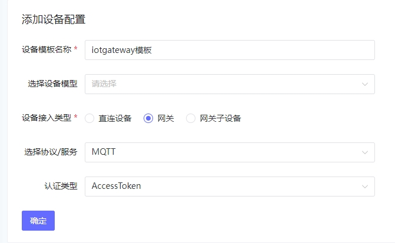

**IoTGateway**是**开源开放**的**跨平台工业物联网网关**，通过**可视化**配置，**南向**的连接到你的任何**设备和系统**(如PLC、扫码枪、上位机、OPC Server等)。

为让使用者快速掌握**北向对接**各种物联网平台的能力，本文以接入**ThingsPanel为例**进行扩展实操。

## 0. 效果展示


## 1. ThingsPanel 介绍

`ThingsPanel`是基于`Go`语言的优秀的**开源**物联网平台。

## 2. ThingsPanel 安装

- 下载`docker-compose.yml`文件https://github.com/ThingsPanel/thingspanel-docker/blob/main/docker-compose.yml
- 启动容器

```docker-compose
docker-compose up -d
```

- 访问`8080`端口,使用租户管理员登录

  > 用户名`tenant@tenant.cn`
  >
  > 密码`123456`

## 3. 设备接入文档与规范

`http://thingspanel.io/zh-Hans/docs/device-connect/gateway`

`https://docs.qq.com/doc/DZXlnb25scnZRc1dK`

## 4. 创建网关设备配置模版



## 5. 创建子设备配置模板


## 6. 创建网关设备

在`设备连接tab`查看并记录`MQTT Username`和`MQTT ClientID`


## 7. 创建子设备


## 8. 网关关联子设备

关联后，记录`子设备地址`


## 9. 添加ThingsPanel平台类型

`iotgateway\IoTGateway.Model\SystemConfig.cs\IoTPlatformType`

```csharp
[Display(Name = "ThingsPanel")]
ThingsPanel = 9
```

## 10. 添加ThingsPanelHandler

参考其他`Handler`，添加`ThingsPanelHandler`

`iotgateway\Plugins\Plugin\PlatformHandler\ThingsPanelHandler.cs`

```csharp
public async Task PublishTelemetryAsync(string deviceName, Device device, Dictionary<string, List<PayLoad>> sendModel)
{
    foreach (var payload in sendModel[deviceName])
    {
        if (payload.Values != null)
        {
            var telemetryData = new Dictionary<string, Dictionary<string, object>>()
            {
                {
                    "sub_device_data", new Dictionary<string, object>()
                    {
                        { deviceName, payload.Values }
                    }
                }

            };
            await MqttClient.EnqueueAsync(new MqttApplicationMessageBuilder().WithTopic($"gateway/telemetry")
                .WithPayload(JsonConvert.SerializeObject(telemetryData)).Build());
        }
    }
}
```

## 11. 修改PlatformHandlerFactory

`iotgateway\Plugins\Plugin\PlatformHandler\PlatformHandlerFactory.cs\PlatformHandlerFactor`

```csharp
case IoTPlatformType.ThingsPanel:
    return new ThingsPanelHandler(mqttClient, logger, onExcRpc);
```

## 12. 添加网关侧子设备

修改后，**运行**`iotgateway`项目，**添加设备**，注意设备名使用**第8步**的`子设备地址`


## 13. 网关侧设备通讯配置


## 14. 网关侧设备变量添加


## 15. 网关侧传输配置

输出平台选择**ThingsPanel**，`用户名、ClientId`，使用**第6步**的`MQTT Username`和`MQTT ClientID`，密码**空**


## 16. 数据查看


## 17. 其他

- 关于**IoTGatway**的其他使用**教程**见**项目首页**：**http://iotgateway.net/**

  **开源地址：**

  - https://gitee.com/iioter/iotgateway

  - https://github.com/iioter/iotgateway

    

  **关如果有其他平台接入需求可留言或加入社区交流**